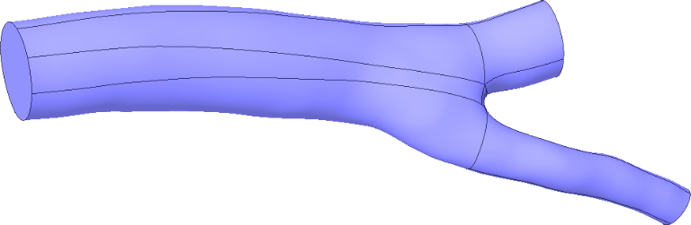
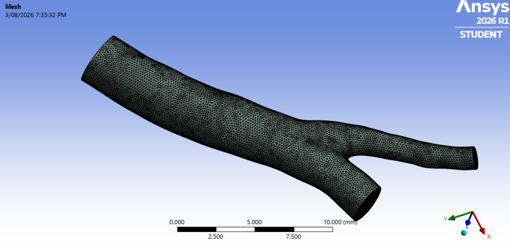
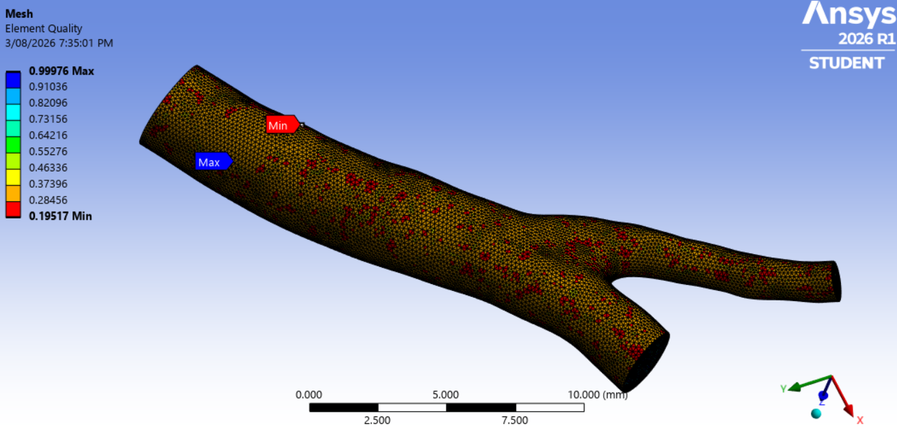

## Geometry
To establish a patient-specific domain for the coronary bifurcation simulation, the STL geometry derived from segmented Cardiac CT data was processed in Ansys Discovery within Ansys Workbench. The length units were initially verified as millimeters under the STL settings prior to importing vessel_geo_1.stl. Key workflow steps executed to convert and refine the domain include:

Surface Conversion: Transformed the raw STL mesh into smooth, continuous surfaces using the Auto Skin tool under the FACETS tab.

Cutting Plane Setup: Placed reference points (DESIGN > CREATE > Point) and planes (DESIGN > CREATE > Plane), then adjusted their positions and orientations using the Move tool (DESIGN > EDIT > Move).

Boundary Trimming: Applied the Split Body tool (DESIGN > INTERSECT > Split Body) using the planes as cutting boundaries to trim the inlet and two outlets, removing excess regions and using Combine where necessary to mend unintentional splits.
<table>
  <tr>
    <td align="center">
       
      <b>
    </td>
 </tr>
</table>

## Mesh Generation

A high-quality computational mesh is essential for accurately resolving the complex flow characteristics within a coronary artery bifurcation. Due to the intricate geometry of the vessel and branching region, an **unstructured tetrahedral mesh** was employed, as it provides excellent geometric conformity while maintaining computational efficiency.

To accurately capture the steep velocity gradients near the vessel walls, **inflation layers** were generated along the arterial wall surfaces. These boundary layers improve the resolution of near-wall flow and enable more accurate prediction of wall shear stress (WSS), which is one of the primary parameters of interest in cardiovascular CFD simulations. Inflation was applied only to the vessel wall surfaces, while the inlet and outlet faces were excluded to avoid unnecessary mesh refinement.

Automatic mesh sizing was used as the initial meshing strategy, followed by a **body sizing** control to ensure uniform element distribution throughout the computational domain. The resulting mesh provided sufficient resolution to capture the flow behavior in the bifurcation region while maintaining a reasonable computational cost.

### Mesh Parameters

| Parameter         | Value                    |
| ----------------- | ------------------------ |
| Mesh Type         | Unstructured Tetrahedral |
| Sizing Method     | Automatic Sizing         |
| Body Element Size | **0.15 mm**              |
| Inflation Layers  | **3 Layers**             |
| Total Elements    | **530,489**              |
| Total Nodes       | **120,332**              |

### Boundary Identification

To facilitate the application of boundary conditions in ANSYS Fluent, the model boundaries were assigned named selections:

| Boundary    | Description                                 |
| ----------- | ------------------------------------------- |
| Inlet       | Blood flow entrance                         |
| Outlet 1    | Primary outlet branch (Left Anterior Descending (LAD))|
| Outlet 2    | Secondary outlet branch  (Left Circumflex (LCx))                   |
| Vessel Wall | No-slip wall boundary with inflation layers |

The generated mesh was subsequently transferred to **ANSYS Fluent**, where the boundary conditions, material properties, and solver settings were defined for the CFD simulation.

<table>
  <tr>
    <td align="center">
       
      <b>
    </td>
    <td align="center">
       
      <b>
    </td>
  </tr>
</table>
