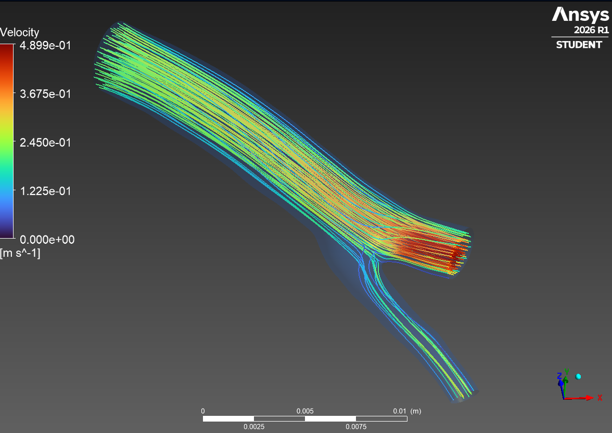
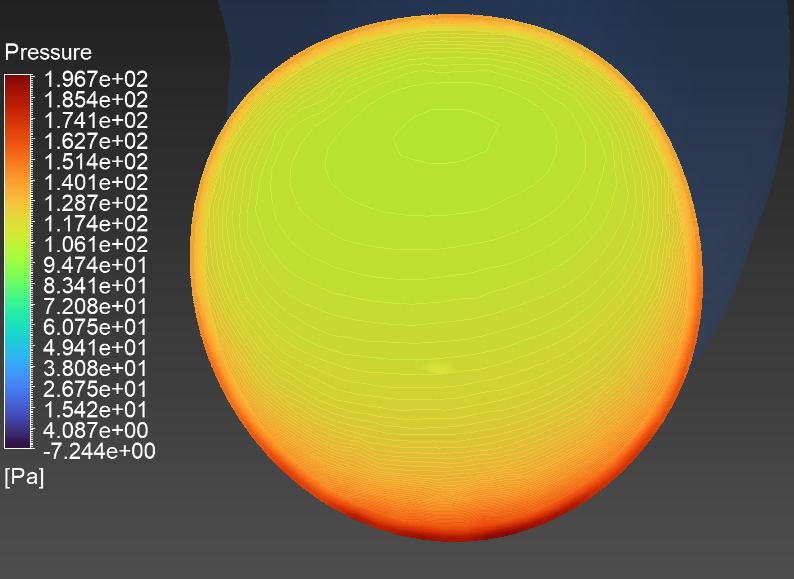
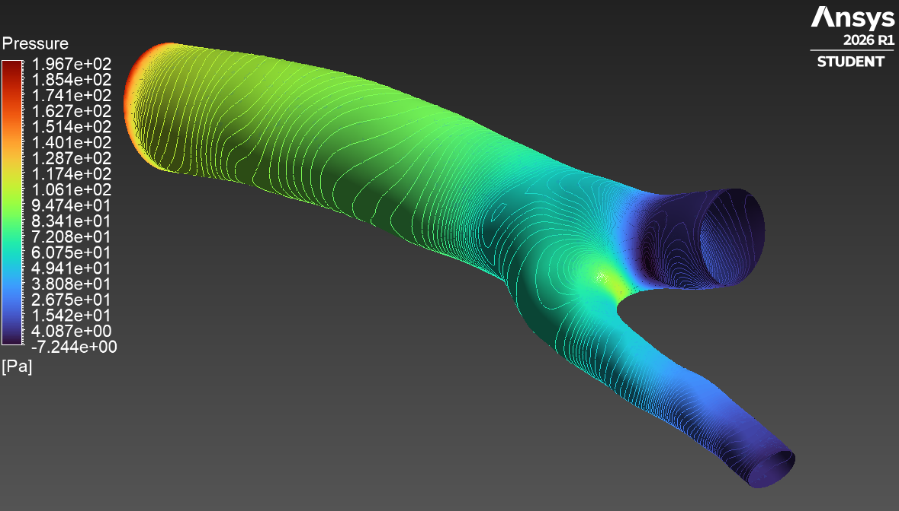
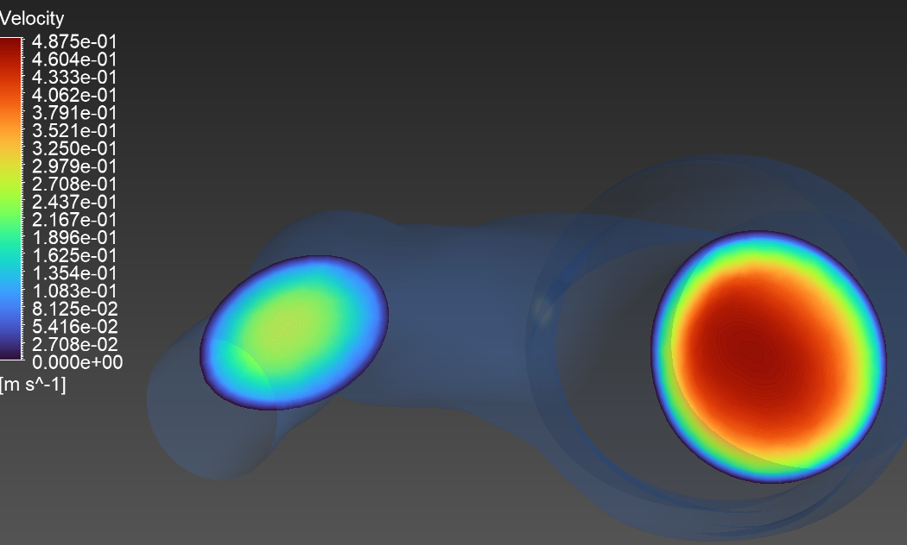
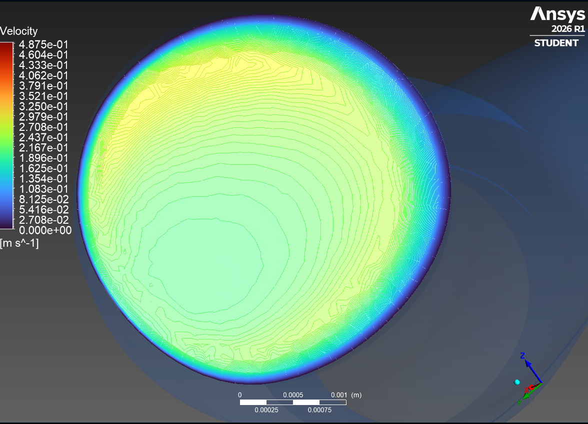
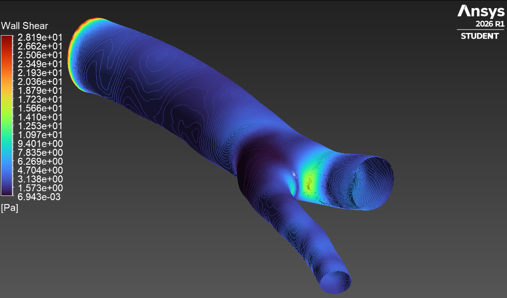

## Streamlines

The streamline plot illustrates the trajectories of blood flow from the parent vessel into the two daughter branches of the coronary bifurcation. The velocity magnitude ranges from 0 m/s at the vessel walls to approximately 0.4899 m/s within the flow core.

Flow remains largely uniform along the parent vessel before reaching the bifurcation. At the bifurcation apex (carina), the flow divides asymmetrically between the two branches. The larger branch maintains a concentrated high-velocity core, whereas the smaller side branch receives a reduced portion of the flow, resulting in lower velocities and the formation of localized secondary flow structures. Small recirculation regions are observed near the outer wall of the side branch, indicating disturbed flow conditions characteristic of arterial bifurcations.
<table>
  <tr>
    <td align="center">
       
      <b>
    </td>
  </tr>
</table>

## Pressure Distribution at the Inlet
The pressure contour at the inlet exhibits a nearly uniform distribution, with pressure values ranging predominantly between 106.1 Pa and 128.7 Pa, while the maximum pressure reaches approximately 196.7 Pa near the lower boundary.

The relatively uniform pressure profile indicates a stable inflow condition and provides the pressure gradient necessary to drive blood through the bifurcated vessel. Minor pressure variations near the boundary are associated with the no-slip wall condition and the developing velocity profile.
  <tr>
    <td align="center">
       
      <b>
    </td>
  </tr>
</table>
        
## Wall Pressure Distribution

The wall pressure contour demonstrates a gradual pressure decrease from the inlet toward the outlets. Pressure decreases from a maximum of approximately 196.7 Pa at the inlet to approximately −7.24 Pa near the outlet regions.

The continuous pressure drop reflects viscous energy losses as blood flows through the vessel. A localized high-pressure region is observed at the bifurcation apex (carina), where the incoming flow directly impinges on the flow divider before splitting into the daughter branches. Downstream of the bifurcation, pressure decreases steadily as the fluid accelerates toward both outlets.
  <tr>
    <td align="center">
       
      <b>
    </td>
  </tr>
</table>

## Velocity Distribution at the Outlets

Velocity contours at the outlet cross-sections reveal an unequal distribution of flow between the two daughter branches. The primary branch exhibits a peak velocity of approximately 0.4875 m/s, while the secondary branch reaches peak velocities between 0.27 m/s and 0.32 m/s.

This unequal flow distribution is a consequence of the asymmetric vessel geometry and differences in downstream hydraulic resistance. The larger branch conveys a greater proportion of the total blood flow, whereas the smaller branch experiences reduced flow rates and a more skewed velocity profile.
  <tr>
    <td align="center">
       
      <b>
    </td>
  </tr>
</table>

## Velocity Distribution at the Inlet

The inlet velocity contour displays a smooth parabolic velocity profile, with maximum velocities between 0.325 m/s and 0.379 m/s at the centerline and velocities approaching 0 m/s at the vessel wall.

This profile is characteristic of fully developed laminar flow. The zero velocity at the wall confirms the implementation of the no-slip boundary condition, while the symmetric velocity distribution indicates a stable inlet flow suitable for the numerical simulation.
  <tr>
    <td align="center">
       
      <b>
    </td>
  </tr>
</table>

## Wall Shear Stress (WSS)

The wall shear stress distribution varies from approximately 6.94 × 10⁻³ Pa to 28.19 Pa. Elevated WSS values are concentrated near the bifurcation apex and along regions of accelerated flow, whereas low WSS regions are observed along the outer walls of the daughter branches.

High WSS at the carina results from steep velocity gradients created as the flow impinges on the bifurcation divider. In contrast, the low WSS regions coincide with areas of flow separation and recirculation, where blood velocity decreases significantly. These low WSS regions are clinically significant because they are associated with endothelial dysfunction, increased lipid deposition, prolonged particle residence time, and the initiation of atherosclerotic plaque formation. Conversely, persistently elevated WSS may contribute to endothelial injury and plaque destabilization under pathological conditions.
  <tr>
    <td align="center">
       
      <b>
    </td>
  </tr>
</table>

## Overall Hemodynamic Observations

The CFD simulation demonstrates that vessel geometry strongly influences blood flow behavior within a coronary artery bifurcation. The bifurcation induces an asymmetric flow split, accompanied by localized pressure gradients, regions of elevated wall shear stress at the carina, and low wall shear stress along the outer walls of the daughter branches. These hemodynamic features agree with established cardiovascular fluid mechanics and highlight why coronary bifurcations are common sites for the initiation and progression of atherosclerosis.
