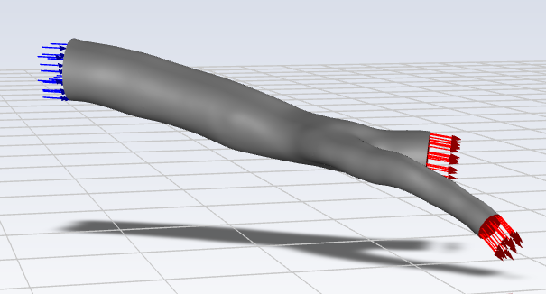

## Simulation Setup

The computational fluid dynamics (CFD) simulation was performed using **ANSYS Fluent** with a pressure-based, steady-state solver. Blood flow through the coronary artery bifurcation was modeled as an incompressible, laminar flow. The governing equations for conservation of mass and momentum were solved using the finite volume method over the generated tetrahedral mesh.

Blood was modeled as a Newtonian fluid with constant density and dynamic viscosity, which is an appropriate approximation for large coronary arteries under physiological flow conditions. The vessel wall was assumed to be rigid with a no-slip boundary condition.

At the inlet, a uniform velocity profile was prescribed to represent physiological blood flow, while pressure outlet boundary conditions were applied at both outlet branches. The solution was initialized using hybrid initialization, and the simulation was iterated until the residuals satisfied the prescribed convergence criteria.

---

## Solver Settings

| Parameter       | Value            |
| --------------- | ---------------- |
| Software        | ANSYS Fluent     |
| Solver Type     | Pressure-Based   |
| Precision       | Double Precision |
| Simulation Type | Steady-State     |
| Flow Regime     | Laminar          |

---

## Material Properties

| Property          | Value           |
| ----------------- | --------------- |
| Fluid             | Blood           |
| Density           | **1050 kg/m³**  |
| Dynamic Viscosity | **0.003 Pa·s** |

---

## Boundary Conditions

| Boundary    | Condition       | Value            |
| ----------- | --------------- | ---------------- |
| Inlet       | Velocity Inlet  | **0.2 m/s**      |
| Outlet 1    | Pressure Outlet | **0 Pa (Gauge)** |
| Outlet 2    | Pressure Outlet | **0 Pa (Gauge)** |
| Vessel Wall | No-Slip Wall    | Stationary       |

---

## Solution Controls

| Parameter             | Value                 |
| --------------------- | --------------------- |
| Initialization Method | Hybrid Initialization |
| Maximum Iterations    | 500                   |
| Convergence Criterion | Residuals ≤ 1 × 10⁻⁴  |

---

### Numerical Solution

The governing equations were discretized using the finite volume method and solved iteratively until convergence was achieved. Convergence was assessed based on the residuals of the continuity and momentum equations, with a convergence criterion of **1 × 10⁻⁴** for all residuals. Following convergence, the solution was post-processed in **ANSYS CFD-Post** to obtain velocity contours, pressure distribution, wall shear stress, streamlines, and other hemodynamic parameters used for analysis.

<table>
  <tr>
    <td align="center">
       
      <b>
    </td>
  </tr>
</table>
